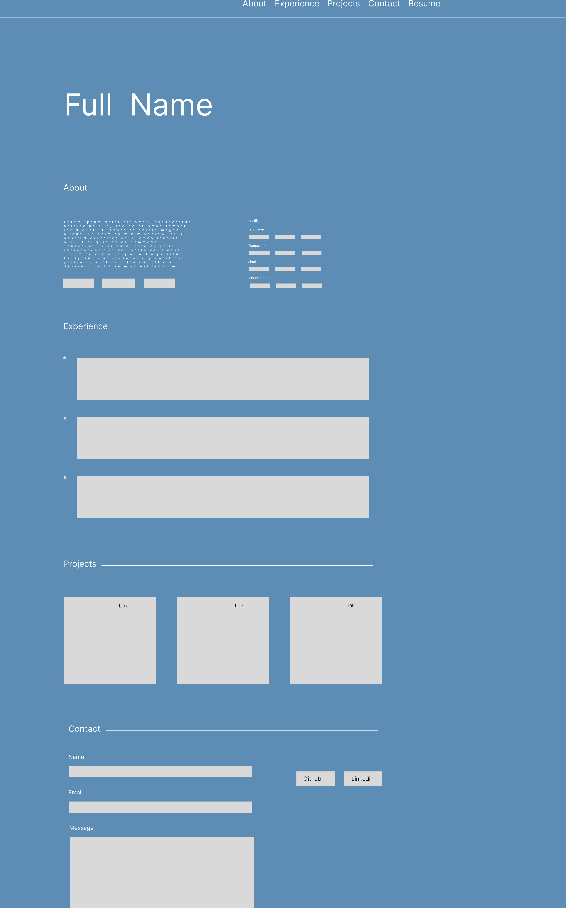

## PART 1: CONTENT (Answer ALL questions)

**1. What is your full name as you want it displayed professionally?**

Arunavo Chowdhury
 
**2. What is the purpose of your portfolio website?**

The purpose of my portfolio to serve as a showcase of my skills, projects, and professional experience as a CS student. 
 
**3. Who is the target audience?**

Peers, professors, and recruiters or employers.
 
**4. What skills do you want to highlight?**
- **Languages:** HTML & CSS, JavaScript, Python, Java, C++, SQL
- **Frameworks & Tools:** React, Bootstrap, Streamlit, Git & GitHub
- **AI / ML:** LlamaIndex, LangChain, NLP, PyMuPDF, Tesseract OCR
- **Cloud & Data:** Firebase, Supabase, Render, Vercel, Netlify

**5. What projects or work will you showcase?**
- **LaxMovies** — Full-stack React app for browsing 500,000+ movies with Firebase authentication and Firestore-backed favorites. Deployed on Netlify.
- **FitnessTrainerAI** — A JavaScript chatbot that generates personalized fitness plans using the Gemini AI API.
- **BlackScholes Dashboard** — An interactive Python/Streamlit dashboard for options pricing using the Black-Scholes model, with real-time Yahoo Finance data, Greeks analysis, and heatmaps.

**6. How will you describe yourself in a short professional bio?**

"I'm currently a senior student at Queens College, majoring in Computer Science. I'm passionate about learning new technologies and I am currently focused on learning backend, AI, and web development. I work across the stack, web apps, AI integrations, data dashboards, and whatever the project calls for."
 
**7. What pages will your site include?**
- Hero 
- About 
- Experience 
- Projects 
- Contact 

**8. What is your career goal or desired role?**

My career goal is becoming a Software Engineer after completing my degree.
 
**9. What technologies or tools do you have experience with?**

React, Firebase, Python, JavaScript, Java, C++, SQL, Streamlit, LlamaIndex, LangChain, PyMuPDF, Tesseract OCR, Bootstrap, Git & GitHub, Supabase, Vercel, Netlify, Render, TMDB API, Yahoo Finance API, Gemini AI.
 
**10. What achievements or experiences are worth highlighting?**
- **Outamation (May–Jul 2025):** Built AI workflows that reduced mortgage document review time by 30% using Python, NLP, and OCR. Developed a RAG pipeline with LlamaIndex improving search accuracy by 25%.
- **Webacy (Aug–Sep 2024):** Performed clustering analysis on 10+ smart contract risk tags, uncovering 5 key vulnerability patterns and improving risk modeling by 20%.
- **Art Beyond Sight (Jul–Aug 2024):** Improved website accessibility for 100+ users by aligning design with WCAG 2.1 standards. Designed and prototyped 5 new site sections.

**11. What call-to-action should visitors take?**

The call to actions visitors should take are the "View My Work", "Contact Me", and "Resume" buttons.

**12. Will you include a resume? In what format?**

Yes, my resume will be stored in the project root. It will be linked in the navbar and about me section, opening in new tab when clicked.
 
**13. What social or professional links will you include?**

GitHub, LinkedIn, Resume
 
## PART 2: DESIGN (Answer ALL questions)
 
**1. What overall style will best represent you?**

My overall style is minimalist with a darker navy.
 
**2. What color scheme will you use and why?**

I will use dark navy for the background because I like the color and it fits my style. Soft white for the text, so theres contrast and it easy on the eyes. Cyan for highlights, interactive elements since its fits well with the dark navy background and gives more energy to my site without being overwhelming.
 
**3. What fonts will you use for headings and body text?**

Space mono for headings and Inter for body text.
 
**4. How will your design reflect your personality or field?**

The blinking cursor reflects that is a developers portfolio or a portfolio of someones whos in the computer science field.
 
**5. What layout will your homepage follow?**

My homepage will follow a single-page scrolling layout with a full-viewport hero section featuring my name large and centered, followed by content sections going down. 
 
**6. How will you organize project sections visually?**

A responsive CSS Grid with three cards side by side on desktop, collapsing to a single column on mobile. Each card contains: project number, links, title, casual description, and tech stack tags.
 
**7. Will the site be mobile-friendly? How will you ensure responsiveness?**

Responsiveness is achieved by using fluid clamp() font sizing and CSS Grid with auto-fit and minmax() to ensure project cards scale seamlessly. For smaller devices under 768px, CSS @media queries collapse the layout into a clean, single-column grid for the About and Contact sections, while a mobile hamburger menu replaces the standard navigation links.

**8. What visual hierarchy will guide visitors?**

The visual hierarchy will guide visitors, with the large hero capturing attention, sections titles for each area, and cards filled with content and details.

**9. How will consistency be maintained across pages?**

Since it's a single-page site, consistency is enforced through CSS variables defined once in `:root` and used everywhere. All section titles follow the same pattern and all cards share the same border/hover styles.
 
**10. How will accessibility be considered?**

Accessibility is built in using semantic HTML tags and high-contrast styling to ensure clean readability. Screen readers are supported via aria-label tags and the lang="en" attribute.

**11. Will you use icons, images, or illustrations? Why?**

I will use SVG icons for GitHub and LinkedIn in the contact section, since they are lightweight and don't require external images.
 
**12. What portfolio websites inspired your design?**
- https://brittanychiang.com/
- https://www.gazijarin.com

---
 
## PART 3: INTERACTIVITY (Answer ALL questions)
 
**1. What interactive elements will your site include?**
- Fixed navigation bar with smooth scroll anchor links
- Active nav link highlighting that updates as the user scrolls
- Hover effects on project cards, skill tags, and social buttons
- Scroll reveal animations, sections fade up as they enter the viewport
- Blinking cursor in the hero section
- Contact form with client-side validation and real submission

**2. Will your site include a contact form? How will it work?**

Yes, the site features a contact form collecting Name, Email, and Message. Upon submission, client-side JavaScript validates the input and uses a fetch() POST request to send the data to Formspree, which routes it directly to my inbox while the UI displays a success or error message to the user.

**3. What JavaScript features will you implement?**
- **Scroll event listener** — adds shadow to nav and highlights active section link
- **IntersectionObserver API** — triggers scroll reveal fade-in animations efficiently without scroll event overhead
- **DOM manipulation** — toggling CSS classes for active states, mobile menu, and reveal animations
- **fetch() API** — async form submission to Formspree with error handling
- **Form validation** — checks for empty fields and valid email format before submitting

**4. How will users receive feedback from interactions?**

Users receive feedback through instantaneous visual cues that acknowledge their actions.

**5. How does interactivity improve the user experience?**

Interactivity keeps users engaged by making the website easy to use.

---

## Project Overview
 
A personal portfolio website built using HTML, CSS, and vanilla JavaScript. The site is a single-page scrolling experience with five sections: Hero, About, Experience, Projects, and Contact.
 
---
 
## Target Audience
 
Peers, professors, and potential employers or recruiters.
 
---
 
## Content Strategy
 
Content is organized to tell a little bit about me, first from who I am, to what I know, what projects I have made, and lastly a way to contact me.
 
---
 
## Information Organization
 
| Section | Content |
|---|---|
| Hero | Name, taglines, bio, resume link |
| About | Bio paragraph, categorized skill tags |
| Experience | Vertical timeline of 3 internships |
| Projects | 3 project cards with descriptions and links |
| Contact | Form, GitHub & LinkedIn |
 
---
 
## Visual Design
 
### Wireframe

 
### Color Palette
| Role | Value |
|---|---|
| Background | `#122038` |
| Card surface | `#1a2d45` |
| Primary text | `#e0e0e0` |
| Muted text | `#8892a4` |
| Accent (cyan) | `#64ffda` |
 
### Typography
| Role | Font |
|---|---|
| Headings | Space Mono (Google Fonts) |
| Body text | Inter (Google Fonts) |
 
---
 
## Interaction / Functionality
 
- Smooth scroll navigation with active link highlighting
- Mobile hamburger menu
- Scroll reveal fade-in animations 
- Project card hover effects 
- Skill tag hover effects
- Contact form with validation and live Formspree submission
- Blinking hero cursor
---
 
## Technical Overview
 
| File | Purpose |
|---|---|
| `index.html` | Single-page structure, all semantic HTML |
| `css/styles.css` | All styling, custom CSS variables, layout, animations, responsive breakpoints |
| `js/main.js` | Navigation behavior, scroll reveal, form submission |
| `resume.pdf` | Downloadable resume linked from nav and about |
 
**External resources:**
- https://developer.mozilla.org/en-US/docs/Web/CSS
- https://css-tricks.com/snippets/css/a-guide-to-flexbox/
- https://css-tricks.com/complete-guide-css-grid-layout/
- https://formspree.io/
- https://developer.mozilla.org/en-US/docs/Web/HTML/Reference/Elements

---
 
## Timeline / Project Milestones

| Milestone | Status |
|---|---|
| Content planning | ✅ Complete |
| Design planning | ✅ Complete |
| Interactivity planning | ✅ Complete |
| HTML | ✅ Complete |
| CSS | ✅ Complete |
| JavaScript | ✅ Complete |
| Deployed to GitHub Pages | ✅ Complete |
